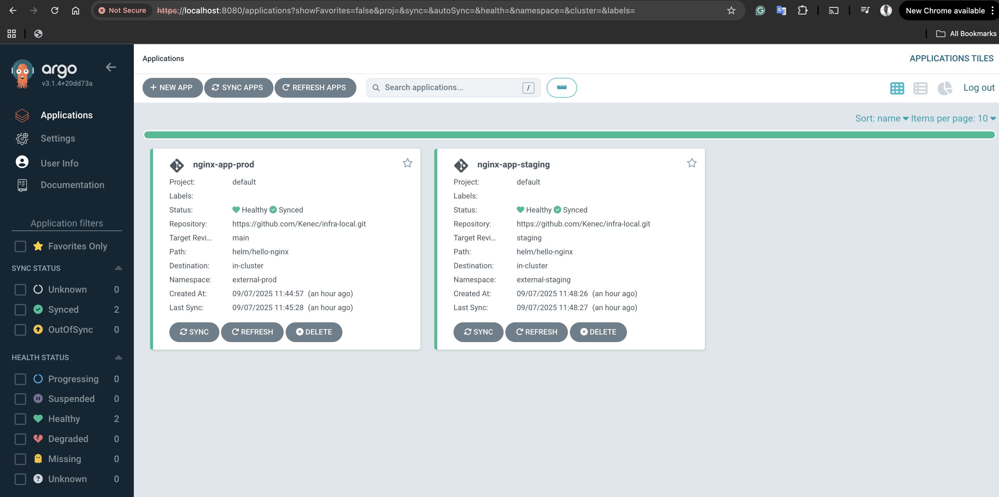
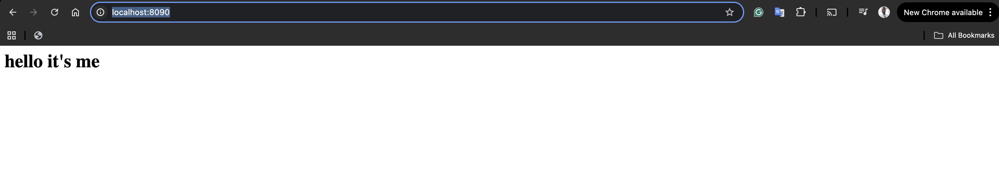
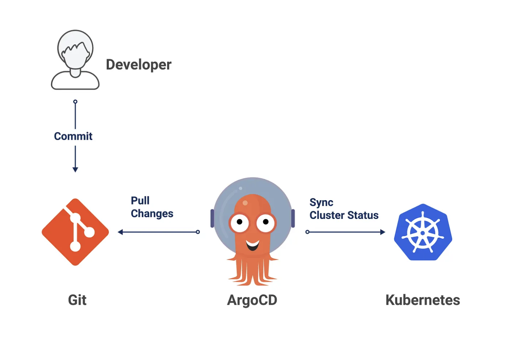

# Infra Local

This is a sample deployment application to demonstrate the use of GitOps approach using ArgoCD to deploy new version of application to staging, promote it production, and rollback to previous version. This setups runs locally.

## Prerequisite Installations
1. [Minikube](https://minikube.sigs.k8s.io/docs/start/?arch=%2Fmacos%2Farm64%2Fstable%2Fbinary+download)
2. [Helm](https://helm.sh/docs/intro/install/)
3. [Make](https://www.gnu.org/software/make/#download)
4. [Terraform](https://developer.hashicorp.com/terraform/install)
5. [Kubectl](https://kubernetes.io/docs/tasks/tools/)

## Setup
```sh
make apply
```

The above command does the following:
1. Starts the Minikube cluster.
2. Creates the necessary namespaces.
3. Deploys ArgoCD to the Minikube.
4. Deploys ArgoCD Application for staging and production.

## Accessing ArgoCD UI

1. Open a new terminal and run.
```sh
kubectl port-forward service/argocd-server -n argocd 8080:443
```

2. Get the ArgoCD admin password.
```sh
kubectl -n argocd get secret argocd-initial-admin-secret -o jsonpath="{.data.password}" | base64 -d
```

3. Open ArgoCD UI from the browser on `http://localhost:8080/`. Login with `username: Admin` and the password from step [2]




## Accessing Staging Nginx Application
1. Open a new terminal and run
```sh
kubectl port-forward svc/nginx-app-staging-hello-nginx -n external-staging 8090:80
```

2. Access the application from the browser on  `http://localhost:8090`.



## ArgoCD Deployment, Promotions, and Rollbacks
### Deployment
ArgoCD is used for continous delivery GitOps tool that continously reconciles the application state in the kubernetes with the kubernetes manifest file in git. 

To deploy application to the Kubernetes cluster using ArgoCD, here are the steps that are to be followed:

1. ArgoCD must be installed in the Kubernetes cluster first. For our use case, running `make apply` takes care of deploying ArgoCD to the Minikube cluster.

2. Define ArgoCD Application YAML file and apply it to the `argocd` namespace. This file defines the source of the Kubernetes manifest, and the target cluster and namespace to which ArgoCD must deploy to.  

```yaml
apiVersion: argoproj.io/v1alpha1
kind: Application
metadata:
  name: nginx-app-staging
  namespace: argocd
spec:
  project: default
  source:
    repoURL: 'https://github.com/Kenec/infra-local.git'
    targetRevision: staging
    path: 'helm/hello-nginx'
  destination:
    server: 'https://kubernetes.default.svc'
    namespace: external-staging
  syncPolicy:
    automated:
      prune: true
      selfHeal: true
```

3. ArgoCD recommends using a separate repository to hold the [Kubernetes manifest](https://argo-cd.readthedocs.io/en/stable/user-guide/best_practices/#separating-config-vs-source-code-repositories). However, you can also use orphaned branches or just the same branches as the service codebase.

4. New application image is built and pushed to the images registry.

5. Update the image tag in the Kubernetes manifest values file to track the newly built image. One way to do this is using `yq`
```sh
yq -i '.image.tag = "my-registry/my-app:${GITHUB_SHA::7}"' values.yaml
```
Another alternative is to use [ArgoCD Image Updater](https://argocd-image-updater.readthedocs.io/en/stable/#argo-cd-image-updater)

6. Once the changes are merged to the active branch, ArgoCD will pick it up and deploy it to Kubernetes.





### Promotion from Staging to Prod
Using the strategy of git branching or tagging, we can carefully deploy to staging and production environment. Here are the steps that can be followed to promote changes to productions:

1. Developer pushes code to the feature branch.
2. Changes are reviews, CI ran, tests passed. After the changes are approved by other developers, the code is merged to the `staging` branch. Once this code is merged, ArgoCD synces the changes made in the branch to the Kubernetes cluster.
3. Now, the code is in staging environment. To deploy same code to production environment, the team will merge the code to the production branch (eg: master).
4. ArgoCD will pick the new changes in the production branch and automatically deploys it to the production Kubernetes cluster.

### Rollbacks
To rollback to any version, we can either use:

1. Git revert to revert back to a specific commit which ArgoCD will automatically see as a change and adjusts the state of the deployed application to reflect the changes.

2. Using ArgoCD Rollback UI: ArgoCD has `History and Rollback` functionality that can be used to rollback to a certain version.

## Monitoring, Alerts, and Thresholds


| Metric                          | Threshold                                                   | Why it matters                                                             |
| ------------------------------- | ----------------------------------------------------------- | -------------------------------------------------------------------------- |
| **Availability**    | Alert if < 99% of requests return `200 OK` over 5 minutes   | Ensure that the app is available and accessible to users.              |
| **Error rate**  | Alert if > 1% over 5 minutes                                | Ensure that the app is successfuly serving traffic.  Error spikes are often the earliest symptom of outages.                               |
| **Latency (p95 response time)** | Alert if > 500ms for 5 minutes                              | Ensures user requests are served quickly (Nginx should normally be <50ms). |
| **Pod health (Ready status)**   | Alert if < desired replicas are ready for >2 minutes        | Detects crash loops or failed rollouts.                                    |
| **CPU usage**                   | Alert if > 80% CPU for >5 minutes                           | Sustained high CPU may cause throttling or unresponsive service.           |
| **Memory usage**                | Alert if > 80% memory for >5 minutes                        | Prevents OOM kills, ensures stability.                                     |
| **Deployment failures**         | Alert if rollout status is not `complete` within 10 minutes | Catches failed upgrades early.                                             |
| **Traffic Request throughput (RPS)**         | Alert on sudden 50%+ drop or spike compared to rolling average baseline | Unexpected drops may mean the service is down, while spikes may cause overload or signal DDoS. Helps capacity planning and anomaly detection.early.                                             |


## Cleanup
```sh
make destroy
```
